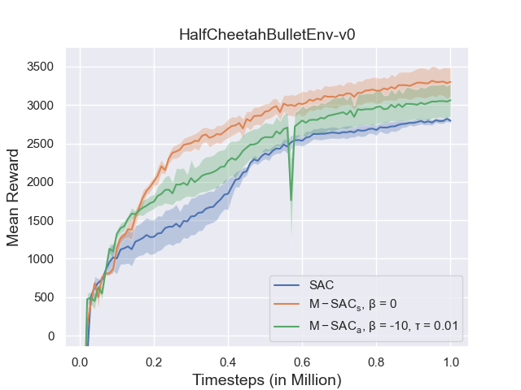

# ADLR 2021 - Project ID 08

Munchausen Reinforcement Learning with Continuous Action Space (M-SAC)

Authors:
* [Marcel Brucker](mailto:marcel.brucker@tum.de)
* [Finn Süberkrüb](mailto:finn.sueberkrueb@tum.de)

Submitted documents:
* [Proposal](./docs/submissions/proposal-08.pdf)
* [Milestone report](./docs/submissions/milestone-report-08.pdf)
* [Milestone presentation](./docs/submissions/milestone-presentation-08.pdf)
* [Final report](./docs/submissions/final-report-08.pdf)
* [Final presentation](./docs/submissions/final-presentation-08.pdf)

## Quick start
The submodules must be checked out with the Branch Munchausen.
Then the training can be started directly from the rl-baselines3-zoo submodule.

`python train.py --algo msac --env HalfCheetahBulletEnv-v0 --tensorboard-log logs/tensorboard --n-timesteps 1000000 --seed 1 --hyperparams munchausen_state_based:True munchausen_mode:"'dynamicshift'" dynamicshift_hyperparameter:-10.0`

|hyperparameter |default| options|
--- | --- | ---
|munchausen_scaling|0.9| |
|munchausen_clipping_low|-10.0| |
|munchausen_clipping_high|10.0| |
|munchausen_mode|"'dynamicshift'"|no_clipping, dynamicshift_minmax, dynamicshift_median, dynamicshift_target_entropy, dynamicshift_normalized, dynamicshift_clipping|
|dynamicshift_hyperparameter|-10.0| |
|munchausen_state_based|True|False|

## Trained models
All trained models can be found under docs/results.

TODO: add some results

## Important Links
* Original Munchausen Reinforcement Learning 2020
  * https://arxiv.org/abs/2007.14430
  * https://github.com/google-research/google-research/tree/master/munchausen_rl
* Stable-Baselines3
   * https://stable-baselines3.readthedocs.io
* Stable-Baselines3 Zoo
  * https://github.com/DLR-RM/rl-baselines3-zoo
* PyBullet Gym
  * https://github.com/benelot/pybullet-gym
  * https://pybullet.org
* Optuna: A hyperparameter optimization framework
  * https://github.com/optuna/optuna

